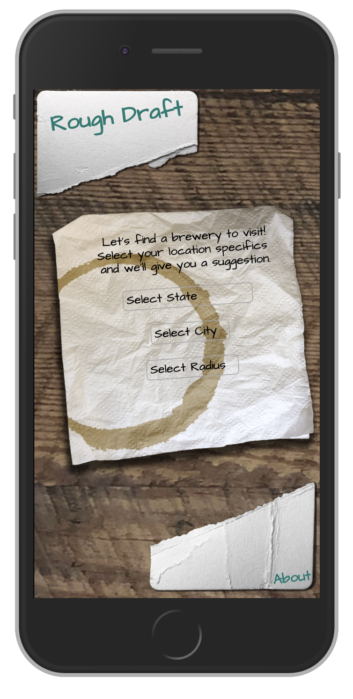

# Rough Draft Beer - Front End Project

## Contents
    -Description
    -Features
    -Technologies
    -Challenges and Solutions
    -MVP
    -Stretch Goals
    -Authors
    -Screenshots

## Decription
"Rough Draft Beer" is a front-end only application designed to search for new and exciting breweries to explore based on user input for city, state, and a radius. The application takes the city, state, and radius and converts it to Latitude and Longitude. The application then loads a map of all breweries around and allows you to click on the icon for detailed information on the brewery selected.

### Features
* A catchy loading GIF appears as the breweries start to be populated.
* Plots breweries to a map based on search criteria.
* When the brewery is hovered over, the name will appear.
* Provides detailed information on each brewery selected.
    * Provides the first image from Google Places
    * Lists the name, phone number, and address of the brewery.
    * The application will give you the rating of the brewery based on Googles rating (represented in beer mugs).
    * The current Open or Closed status is also provided from the Google Places API
    * If the user allows their location to be shared, it will give the distance in miles from the user to the brewery, otherwise it gives the distance from the center of the city selected (via Open Cage Geolocation API) to the brewery.
    * The current weather at the brewery is displayed via an icon. The weather is found from OpenWeatherMap API.
    * The application also provides a link to Google Maps that will plot directions to the brewery from your supplied current location.
    * Lastly, the Application provides a link to visit the breweries website.
* A Search button appears when on the map card, allowing the user to enter new search criteria.
* While on the results page, a back button will appear. This allows the user to easily go back to the map and select another brewery.

## Technologies
* HTML
* CSS
* Javascript
* Google Places API
* OpenBreweryDB API
* OpenWeatherMap API
* OpenCage Geocoding API

## Challenges and Solutions
* Making the screen responsive for devices was a big challenge.  We handled this by using the vh aned vw font size measurements (instead of percentages) and simply using the screen size minimum side to decide.  Basically, if the screen is in portait mode - and the width is less than the height, then we use vw.  Othwewise use vh.  This was especially important because we locked our screen size to the initial dimensions of the device and there is no scrolling within the app.

    Additionally, mobile devices handled the overflow differently than desktop devices.

    The custom graphics - napkins, coasters, and the table were fun assets to photograph and edit in photoshop and illustrator.  The water rings were custom brushes that Margaret had created years ago and they worked perfectly in this project.  Tiny assets like the beer mug and favicons were fun extras.

* Having the application load the cities in the drop down menu based on the state selected was a challenge early on. We handled this by pulling in all of the states and corresponding cities into a JSON file, bypassing an unneccessary extra API call.

    We then manipulated the DOM to listen for when the state selection had changed, we would then appended under the city element all the corresponding cities for the seleted state. Putting all the cities in a JSON file made it so the cities populating was instantaneous

* Learning to anticipate broken, incomplete, or poorly formatted information from APIs was a significant challenge. Realizing that OpenBreweyDB’s API did not reliably contain the information we wanted, our initial approach involved using each business’s phone number to look up a fuller database of details from the Yelp Fusion API. However, due to inconsistencies within the OpenBreweryDB’s supplied phone numbers, our approach had to evolve to take advantage of fuzzy name matching possible (and reliably consistent) with Google Maps  API’s Places Detail Search. Integration with the Google Maps platform was surprisingly easy and robust, solving a lot of the initial difficulties in working incomplete data.

    Additionally, given the number of APIs this project worked with, this project includes a complex structure of asynchronous code. Learning to work with multiple `promises` proved slowed.

## MVP
* Create a basic front-end application that allows you to search for local breweries based on search criteria.
* Requirements
    * Can use given city, state, and radius to plot breweries on a map.
    * Each individual result will show when their icon is clicked on.
    * The page is fully responsive to accommodate multiple browsers and devices.

## Stretch Goals
* Implement Google to plot multiple breweries to a map.
    * Completed
* Enable search by type of beer
    * Incomplete

## Authors
* Matt Raines
    * Contributions:
        * Concept, DOM Manipulation, Weather API Implementation
    
    [GitHub Profile](https://github.com/mraines4)

* Jonathan Ray
    * Contributions:
        * Concept, Open Cage/Google/OpenBrewery API integration, Distance Formulation, Geolocation Implementation
    
    [GitHub Profile](https://github.com/ray-jonathan)

* Margaret ONeill
    * Contributions:
        * Concept, Layout, Responsive Design, Distance Formulation
    
    [GitHub Profile](https://github.com/MAOneill)

## Screenshots
* Desktop

* Mobile

